# 🏔️ Beacon GTM Lakehouse

> **An end-to-end, locally-runnable Medallion data lakehouse for a B2B SaaS go-to-market (GTM) pipeline, from raw CRM sales data to analytics-ready BI tables.**

Built on the **actual Maven Analytics *CRM Sales Opportunities*** dataset, this repository turns four raw CSVs into a clean Silver layer and a set of pre-aggregated Gold tables served from PostgreSQL — using PySpark, MinIO (S3-compatible object storage), Redpanda (Kafka-API), and Apache Airflow. Everything runs on your laptop via Docker; no cloud account required.

<div align="center">
  
  
  
  
  
  
  
  
</div>

---

### ⚡ Quickstart (3 steps)

```bash
# 1. Start all infrastructure (MinIO, Postgres, Redpanda, Airflow, Spark)
docker compose up -d

# 2. Run the entire pipeline — one command. Streams logs live and saves them to logs/.
python scripts/run_pipeline.py
#    Windows without Hadoop/winutils? Use the Docker backend instead:
#    python scripts/run_pipeline.py --backend docker --build-image

# 3. View the results dashboard — explains the project AND shows analytics.
streamlit run dashboard/app.py
```

---

## Table of Contents

1. [Overview](#overview)
2. [Architecture](#architecture)
3. [Tech Stack](#tech-stack)
4. [The Dataset](#the-dataset)
5. [The Medallion Architecture](#the-medallion-architecture)
6. [Prerequisites](#prerequisites)
7. [Setup / Quickstart](#setup--quickstart)
8. [What Each Pipeline Stage Does](#what-each-pipeline-stage-does)
9. [The Complete Data Flow — End to End](#the-complete-data-flow--end-to-end)
10. [How This Was Built (Development Journey)](#how-this-was-built-development-journey)
11. [Replicating This for Another Dataset](#replicating-this-for-another-dataset)
12. [Data Quality & Quarantine](#data-quality--quarantine)
13. [Optional Advanced Topics](#optional-advanced-topics)
14. [The Analytics Queries](#the-analytics-queries)
15. [BI Integration — Power BI & friends](#bi-integration--power-bi--friends)
16. [Key Highlights](#key-highlights)
17. [Learning Path](#learning-path)
18. [Project Structure](#project-structure)
19. [Troubleshooting](#troubleshooting)
20. [Roadmap / Possible Extensions](#roadmap--possible-extensions)
16. [Learning Path](#learning-path)
17. [Project Structure](#project-structure)
18. [Troubleshooting](#troubleshooting)
19. [Roadmap / Possible Extensions](#roadmap--possible-extensions)

---

## Overview

**Beacon GTM Lakehouse** models the data platform a real B2B SaaS company needs to understand its sales pipeline. The source of truth is the **actual Maven Analytics *CRM Sales Opportunities*** dataset — a small, well-known relational dataset describing deals sold by a fictitious computer-hardware company. It consists of four small tables that share natural keys (company names and product names instead of surrogate IDs), which is exactly the shape of a real CRM export.

This project demonstrates the full data-engineering skill set:

- **Medallion architecture** — Bronze / Silver / Gold layering with Parquet as the storage format and clear responsibilities at each layer.
- **Batch ETL with Spark** — schema enforcement, deduplication, validation, joins on natural keys, and aggregation written in PySpark.
- **Data quality engineering** — explicit validation rules, a quarantine pattern for rejected rows, and a quality log you can trend over time.
- **A serving layer** — Gold tables loaded into PostgreSQL for plain-SQL / BI consumption.
- **Streaming** — a real-time path where a producer writes events to Redpanda (Kafka-API) and Spark Structured Streaming consumes them.
- **Orchestration** — an Airflow DAG wiring the whole batch pipeline together with retries and scheduling (always-on by default).

The honest framing: *"I built a Bronze → Silver → Gold lakehouse using the actual Maven CRM dataset, enforced data quality with a quarantine pattern, joined on natural keys (company/product names), benchmarked and optimized a Spark join, and wired up a Kafka streaming path with Airflow orchestration — all of which you can reproduce on this repo."*

---

## Architecture

<div align="center">
  
</div>

A text version of the same flow (handy in plain-text editors / terminals):

```
                              DATA SOURCES
                  ┌──────────────────────────────────┐
                  │  Actual Maven CRM "Sales         │
                  │  Opportunities"                  │
                  │   accounts.csv  · products.csv   │
                  │   sales_teams.csv · sales_pipeline.csv │
                  │   (in actual_maven_data/          │
                  │    CRM+Sales+Opportunities/)     │
                  └──────────────────┬───────────────┘
                                     │  raw CSVs
                                     ▼
                        ┌───────────────────────────┐
                        │  BRONZE  (raw / landing)  │
                        │  data/bronze/maven/*.csv   │
                        └────────────┬──────────────┘
                                     ▼
                    ┌──────────────────────────────────┐
                    │  PySpark batch ETL #1            │
                    │  spark_jobs/bronze_to_silver.py  │
                    │  schema enforcement · validate · │
                    │  deduplicate · quarantine        │
                    │  (joins on natural keys:         │
                    │   account name, product name)    │
                    └──────────────┬───────────────────┘
                                   │
                    ┌──────────────┴───────────────┐
                    ▼                              ▼
        ┌──────────────────┐            ┌─────────────────────┐
        │ SILVER (clean)   │            │ QUARANTINE (rejected)│
        │ dims + fact,     │            │ + reason flags       │
        │ Parquet, year/   │            │ data/quarantine/     │
        │ month-partitioned│            └─────────────────────┘
        │ data/silver/     │
        └──────────┬───────┘
                   ▼
        ┌────────────────────────────────┐
        │  PySpark batch ETL #2          │
        │  spark_jobs/silver_to_gold.py  │
        │  business aggregations         │
        └──────────────┬─────────────────┘
                       ▼
        ┌───────────────────────────────┐
        │ GOLD  (analytics-ready)       │
        │ account_performance           │
        │ sales_rep_performance         │
        │ product_performance           │
        │ pipeline_funnel               │
        │ data_quality_log              │
        │ data/gold/*.parquet           │
        └──────────────┬────────────────┘
                       ▼
        ┌─────────────────────────────────────┐
        │  load_gold_to_postgres.py (JDBC)    │
        │  spark_jobs/load_gold_to_postgres.py │
        │  gold schema in PostgreSQL           │
        └──────────────┬───────────────────────┘
                       ▼
              ┌──────────────────┐
              │  BI / SQL layer  │
              │  sql/analytics_  │
              │  queries.sql     │
              └──────────────────┘

    OPTIONAL PATHS
      ┌────────────────────────────┐     ┌───────────────────────────┐
      │ streaming:                 │     │ orchestration:             │
      │ ingestion/kafka_producer   │     │ airflow/dags/gtm_pipeline_ │
      │  → Redpanda (Kafka API)    │     │ dag.py                     │
      │  → spark_jobs/streaming_   │     │ (runs daily, always-on)    │
      │    events.py               │     └───────────────────────────┘
      └────────────────────────────┘
```

---

## Tech Stack

| Technology | Role in this project |
|---|---|
| **Apache Spark (PySpark 3.5)** | Batch ETL engine — runs all Bronze → Silver and Silver → Gold transformations locally, plus Structured Streaming. |
| **MinIO** | S3-compatible object store that stands in for the data lake. Bronze / Silver / Gold zones live here as objects; Spark talks to it via the S3 API. |
| **PostgreSQL 16** | Serving layer — holds the `gold` schema that a BI tool or analyst queries with plain SQL. |
| **Redpanda** | Kafka-API-compatible streaming broker (no ZooKeeper, lighter than Kafka). Powers the real-time ingestion path. |
| **Apache Airflow** | Orchestration — schedules and runs the batch pipeline as a DAG with retries, backoff, and dependency management (always-on by default). |
| **psycopg2 / Postgres JDBC** | Database connectivity — Python-side for verification, JDBC driver for Spark's `DataFrameWriter.jdbc()`. |
| **Python** | Glue for data ingestion, local orchestration (`run_pipeline.py`), and the Kafka producer. |

> **Why local stand-ins instead of real cloud services?** MinIO speaks the S3 API and Redpanda speaks the Kafka API, so the code you write here (`s3a://` paths, `kafka-python` calls, Spark's `kafka` connector) is the same code you would point at real S3 or MSK later. That is a legitimate and strong portfolio point: *"I built this against S3-compatible / Kafka-API-compatible local services, so the same code ports to a managed cloud stack without changes."*

---

## The Dataset

The source is the **actual Maven Analytics *CRM Sales Opportunities*** dataset — a real, downloadable, community-famous dataset about a fictitious computer-hardware company's B2B sales pipeline. It consists of **four relational CSV tables** that share **natural keys** (company names and product names instead of surrogate IDs).

The dataset is located in `actual_maven_data/CRM+Sales+Opportunities/` and contains:
- **accounts.csv** — 86 accounts/companies
- **products.csv** — 7 products
- **sales_teams.csv** — 35 sales team members
- **sales_pipeline.csv** — ~8,800 pipeline opportunities

### accounts — the customers

One row per company a deal is sold to (the customer dimension). Uses **company name** as the natural key.

| Column | Type | Meaning |
|---|---|---|
| `account` | text | Company name (natural key, e.g. `Kulas Inc`). Foreign key target for `sales_pipeline.account`. |
| `sector` | text | Industry sector (Technology, Medical, Retail, Finance, Entertainment, Telecommunications, Services, Employment). |
| `year_established` | integer | Year the company was founded. |
| `revenue` | real | Annual revenue (in millions USD). |
| `employees` | integer | Number of employees. |
| `office_location` | text | Headquarters location (city, state, country combined). |
| `subsidiary_of` | text (nullable) | Parent company name; empty for independent companies. |

### products — the catalog

One row per product the company sells. Uses **product name** as the natural key.

| Column | Type | Meaning |
|---|---|---|
| `product` | text | Product name (natural key, e.g. `GTX 1080`). Foreign key target for `sales_pipeline.product`. |
| `series` | text | Product line / family (e.g. `MX`, `GTX`, `RTX`, `DataPro`, `GT`). |
| `sales_price` | real (USD) | List price per unit. |

### sales_teams — the organization

One row per sales representative, including their reporting line and office.

| Column | Type | Meaning |
|---|---|---|
| `sales_agent` | text | The sales rep's full name (natural key). Foreign key target for `sales_pipeline.sales_agent`. |
| `manager` | text (nullable) | That rep's manager's name (empty for the director). |
| `regional_office` | text | The geographic office the rep sits in (e.g. `New York`). |

### sales_pipeline — the deals (fact table)

The heart of the dataset: **one row per sales opportunity / deal**, joining together the other three tables on **natural keys**.

| Column | Type | Meaning |
|---|---|---|
| `opportunity_id` | text | Unique opportunity key, e.g. `OPP-00001`. |
| `sales_agent` | text | The rep who owns the deal (FK → `sales_teams.sales_agent`). |
| `product` | text | The product being sold (FK → `products.product`). |
| `account` | text | The customer being sold to (FK → `accounts.account`). |
| `deal_stage` | text | Current funnel stage: `Prospecting` → `Engaging` → `Qualification` → `Proposal` → `Negotiation` → `Won`/`Lost`. |
| `engage_date` | date | The date the opportunity entered the pipeline. |
| `close_date` | date (nullable) | The date the deal closed; blank for open deals. |
| `close_value` | real (nullable) | Recognized revenue (USD) if the deal was Won; 0/blank while open. |

**Note on deal stages:** The actual Maven dataset includes an `Engaging` stage between `Prospecting` and `Qualification`. The pipeline preserves this actual stage rather than mapping to the traditional funnel.

### Dataset scale, and real vs. synthetic

**How big is it?** Small — a *textbook* dataset, not a big-data one. On disk it is roughly **645 KB**: the fact table `sales_pipeline.csv` is **~8,800 rows**, with 85 accounts, 7 products, and 35 sales reps. That is by design: the Maven CRM set is a community-famous *teaching* dataset chosen for its realistic **shape** (messy data, natural keys, a real CRM schema), not its volume.

**Is it big enough for the batch pipeline?** For demonstrating **correctness, architecture, and data quality** — yes, absolutely. Every hop (Bronze → Silver → Gold → Postgres) runs real code end-to-end and the quarantine pattern has thousands of genuinely rejected rows to work on. But for demonstrating **scale and performance** — no. Spark comfortably handles billions of rows; 8,800 rows is far too small to show off distributed processing or justify Spark's raw throughput. That is an honest limitation of any teaching dataset.

**Is it big enough for streaming?** The **streaming path is separate from the Maven dataset** — `kafka_producer.py` synthesizes events (they don't come from the CSVs) and `streaming_events.py` consumes them. As a *demo* of Spark Structured Streaming (watermarks, dedup, micro-batches) it is fine. But real streaming value appears only at scale and with continuously-arriving data — a static 8,800-row snapshot is not "streaming-grade" volume. So: **good enough to demonstrate the streaming *pattern*, not to demonstrate streaming *scale*.**

**Is the real dataset better than synthetic data?** For this project, **yes** — and that is why the actual Maven CRM set was chosen:

- **Real messiness.** The actual data contains genuine quality problems the pipeline must find — a known typo (`technolgy`), orphaned/empty accounts (~1,425 rows), missing dates, and natural-key inconsistencies. Synthetic data is typically clean and self-consistent, so the **quarantine and data-quality story has almost nothing real to catch** (you'd have to inject problems artificially).
- **Natural keys you didn't design.** Real data uses company names and product names as keys. You must discover and respect that schema rather than invent surrogate IDs — closer to real engineering.
- **Credibility.** "I built this on the actual Maven CRM dataset" is a stronger, more honest portfolio claim than "I generated my own data."

The one thing synthetic data does better is **volume on demand** (unlimited rows, exact control of shape). If the goal were to benchmark Spark at scale rather than demonstrate the pipeline, a synthetic generator would be the right tool. For this project's purpose — a correct, realistic, end-to-end lakehouse — the **actual dataset is the better choice**, with the small size being a known, acceptable trade-off.

---

## The Medallion Architecture

The Medallion pattern (a.k.a. the **multi-hop** architecture) is a de-facto standard for organizing a data lake into progressive layers of quality and structure. Each hop is a new Parquet dataset with a stricter guarantee than the last.

### Bronze — raw / landing

- **Contents here:** the four raw Maven CSVs (`accounts`, `products`, `sales_teams`, `sales_pipeline`) in `data/bronze/maven/`.
- **Purpose:** an immutable, byte-for-byte copy of the source (lightly cleaned: trimmed strings, parsed dates/numbers). Nothing is transformed; it exists so you can always re-derive downstream layers from the true source of record.
- **Guarantee:** only "it is here at all."

### Silver — clean, validated, integrated

- **Contents here:** validated, deduplicated **dimension** tables and an **opportunity fact** table, plus a **quarantine** table for rejected records.
- **Purpose:** this is where data quality is enforced. Records are deduplicated, foreign keys and value ranges are checked (referential integrity on natural keys), dates are parsed, and bad rows are separated out instead of silently dropped. The fact table is partitioned by `year` / `month` so later reads can prune scans.
- **Guarantee:** *"every row here is valid and clean."*

### Gold — analytics-ready

- **Contents here:** pre-aggregated, denormalized tables optimized for reporting: `account_performance`, `sales_rep_performance`, `product_performance`, `pipeline_funnel`, `monthly_revenue` (won revenue per close month, for time-series), and `data_quality_log`.
- **Purpose:** a BI tool or analyst should not need to write complex multi-join Spark queries — the hard work is pre-computed into small, fast tables. These are also loaded into the PostgreSQL `gold` schema for serving.
- **Guarantee:** *"every row here is a directly-queryable business metric."*

---

## Prerequisites

Before you start, make sure you have:

- **Docker Desktop** (required for MinIO, PostgreSQL, Redpanda, Airflow, and Spark)
- **Python 3.9+** (for running the local orchestrator `scripts/run_pipeline.py`)
- **Java 11+** (only needed if running Spark locally instead of in Docker) — verify with `java -version`

> **Windows users:** Spark + Hadoop native libraries are notoriously painful on Windows. This project includes a `Dockerfile.spark` that packages Spark in a Linux container with all JARs baked in — no `winutils.exe` or `HADOOP_HOME` hacks needed. The recommended path is the Docker-based one below.

---

## Setup / Quickstart

### 1. Start the local infrastructure (MinIO + Postgres + Redpanda + Airflow + Spark)

```bash
docker compose up -d
```

- MinIO console: <http://localhost:9001> — user `beacon` / password `beacon12345`
- Redpanda Console: <http://localhost:8080>
- Airflow UI: <http://localhost:8080> — user `admin` / password `admin`
- PostgreSQL: `localhost:5432` — user `beacon` / db `beacon` / password `beacon`
- Spark container: `beacon-spark` (runs `sleep infinity` — invoke jobs with `docker compose run --rm spark ...`)

The `minio-init` service auto-creates the lakehouse buckets on first boot, and the Postgres `gold` schema is created automatically from `sql/gold_schema.sql` on first boot. Airflow initializes its DB and creates the admin user on first run.

### 2. Run the full pipeline (one command)

```bash
python scripts/run_pipeline.py
```

This runs all 6 steps:
1. **Ingest actual Maven CRM data** → `data/bronze/maven/`
2. **Streaming demo (bounded: 30s)** → `data/bronze/streaming_events/`
3. **Bronze → Silver** (clean, validate, quarantine) → `data/silver/`
4. **Silver → Gold** (analytics aggregations) → `data/gold/`
5. **Gold → Postgres** (serving layer) → `gold.*` schema in Postgres
6. **Airflow** (already running, DAG scheduled daily)

Logs are streamed live AND persisted to `logs/pipeline_<timestamp>.log`.

**Windows / no Java:** Use the Docker backend (recommended):
```bash
python scripts/run_pipeline.py --backend docker --build-image
```

### 2b. Run each step manually (simulate the pipeline stage by stage)

The one command above runs everything, but to **simulate the pipeline by hand** — or to debug a single hop in isolation — run each stage on its own. Both backends are shown below; use the **Docker** one on Windows (no local Java/Hadoop needed). The `--out` / `--bronze` / `--silver` / `--gold` / `--quarantine` flags all have sensible defaults, so these are the explicit forms — omit a flag to use the default location.

**Docker backend** (runs inside the `spark` container; the repo's `./data` is bind-mounted at `/app/data`):

```bash
# Step 1 — Ingest: actual Maven CSVs → Bronze (data/bronze/maven/)
docker compose run --rm spark python /app/scripts/ingest_actual_data.py --out /app/data/bronze/maven

# Step 2 — Bronze → Silver: clean, validate, quarantine (data/silver/, data/quarantine/)
docker compose run --rm spark python /app/spark_jobs/bronze_to_silver.py \
    --bronze /app/data/bronze/maven --silver /app/data/silver --quarantine /app/data/quarantine

# (optional) log this run's quality metrics to Postgres gold.data_quality_log —
#   fill in the counts printed by the step above
docker compose run --rm spark python /app/spark_jobs/log_quality_metrics.py \
    --input-rows 8800 --duplicates 0 --passed 6117 --quarantined 2683 --elapsed 12.3

# Step 3 — Silver → Gold: analytics aggregations (data/gold/)
docker compose run --rm spark python /app/spark_jobs/silver_to_gold.py \
    --silver /app/data/silver --gold /app/data/gold

# Step 4 — Gold → Postgres: serving layer (gold.* schema)
docker compose run --rm spark python /app/spark_jobs/load_gold_to_postgres.py --gold /app/data/gold
```

**Streaming path** (optional, bounded demo — producer then consumer):

```bash
# 1. produce 500 events to the Redpanda topic "gtm-events"
docker compose run --rm spark python /app/ingestion/kafka_producer.py \
    --brokers redpanda:29092 --topic gtm-events --rate 50 --count 500

# 2. consume + process for 30 seconds → data/bronze/streaming_events/
docker compose run --rm spark python /app/spark_jobs/streaming_events.py \
    --brokers redpanda:29092 --topic gtm-events --bronze-out /app/data/bronze \
    --watermark-minutes 2 --duration-seconds 30
```

**Native backend** (local Python + Java instead of Docker; paths relative to the repo root):

```bash
python scripts/ingest_actual_data.py --out data/bronze/maven
python spark_jobs/bronze_to_silver.py --bronze data/bronze/maven --silver data/silver --quarantine data/quarantine
python spark_jobs/silver_to_gold.py --silver data/silver --gold data/gold
python spark_jobs/load_gold_to_postgres.py --gold data/gold
```

### 3. View the results dashboard

```bash
streamlit run dashboard/app.py
```

This opens an interactive Streamlit app at `http://localhost:8501` that explains the project and visualizes the results.

---

## What Each Pipeline Stage Does

### `scripts/ingest_actual_data.py` — Ingest Actual Maven Data

Copies the actual Maven CRM CSVs from `actual_maven_data/` to the Bronze layer with minimal normalization:
- Strips whitespace from string columns
- Casts numeric columns to proper types (int/double)
- Parses dates to `YYYY-MM-DD` format
- Fixes known typo: `technolgy` → `Technology` in sector
- Preserves **natural keys** (account name, product name) — no surrogate IDs

### `spark_jobs/bronze_to_silver.py` — Bronze → Silver

The first transformation job. It reads the raw Maven CSVs from the Bronze zone and performs the cleanup work:

1. **Reads** the four source tables with CSV headers.
2. **Parses/casts** date and numeric columns to proper Spark types.
3. **Deduplicates** the opportunity fact table on the primary key (`opportunity_id`), keeping the first occurrence.
4. **Runs data-quality checks** — each row is tagged with a boolean failure flag per rule (null key, orphan foreign key on natural keys, invalid stage, bad date, negative value). No row is silently dropped; the checks *label* the row with a reason.
5. **Splits** the data into a **good** stream (→ Silver) and a **bad** stream (→ Quarantine).
6. **Enriches** the clean fact table with `year` / `month` columns and **partitions** the Parquet output by them for scan pruning.
7. **Writes** clean dims + fact to `data/silver/` and rejected rows to `data/quarantine/`, printing a summary of counts.

### `spark_jobs/silver_to_gold.py` — Silver → Gold

The second transformation job. It reads the clean Silver Parquet tables and builds the **pre-aggregated analytics tables** a BI tool would actually query:

- **`account_performance`** — per-customer metrics: total opportunities, win counts, won revenue, win rate, avg deal size, avg days to close. Enriched with company attributes (sector, year_established, revenue, employees, office_location, subsidiary_of).
- **`sales_rep_performance`** — per-rep metrics: opportunities handled, deals won, total won revenue, win rate, avg deal size, avg days to close. Enriched with manager + regional_office.
- **`product_performance`** — per-product metrics: opportunities, deals won, won revenue, win rate, avg deal size, avg days to close. Enriched with series + sales_price.
- **`pipeline_funnel`** — stage-level counts and values so you can see the shape of the funnel and the conversion from top-of-funnel (Prospecting). Uses actual Maven stages: Prospecting → Engaging → Qualification → Proposal → Negotiation → Won/Lost.
- **`data_quality_log`** — a record of this run's quality metrics (input rows, duplicates removed, passed, quarantined, elapsed), so quality can be trended across runs.

Each is written as Parquet to `data/gold/` in a small, denormalized, join-free shape ready for `SELECT *` reporting.

### `spark_jobs/load_gold_to_postgres.py` — Gold → Serving Layer

The final hop. It reads each Gold Parquet table and writes it into the PostgreSQL `gold` schema via the **JDBC** connector (`DataFrameWriter.jdbc()`). After this runs, analysts can query the Gold tables with plain SQL from any BI tool, and you can run the analytic queries in `sql/analytics_queries.sql`.

> Connection details come from env vars (`PG_HOST`, `PG_PORT`, `PG_DB`, `PG_USER`, `PG_PASSWORD`) — see `.env.example`. The Postgres JDBC driver is baked into the Spark Docker image.

---

## The Complete Data Flow — End to End

This section walks the **whole pipeline** in the order it actually runs, tracing each byte from the source CSV to the dashboard. It is the answer to *"where does it start, what happens, and what is saved?"*

### 0. The starting point — `actual_maven_data/`

```
actual_maven_data/CRM+Sales+Opportunities/
├── accounts.csv         # 86 customer companies
├── products.csv         # 7 products
├── sales_pipeline.csv   # ~8,800 opportunities (the FACT table)
├── sales_teams.csv      # 35 sales reps
└── data_dictionary.csv  # column descriptions (reference only)
```

These four CSVs are the **raw, unprocessed source of truth**. Nothing downstream modifies them — they are read-only inputs. The lakehouse is *derived* from them.

### 1. `docker compose up -d` — infrastructure spins up

Bringing up the stack starts **MinIO, Postgres, Redpanda, Airflow, and Spark**. Two things happen automatically at boot (only once):

- **`minio-init`** creates the four lake buckets (`beacon-raw`, `beacon-curated`, `beacon-gold`, `beacon-lakehouse`) in MinIO.
- **Postgres** runs `sql/gold_schema.sql`, which creates the `gold` schema and its tables (`account_performance`, `sales_rep_performance`, `product_performance`, `pipeline_funnel`, `monthly_revenue`, `data_quality_log`).
- **Airflow** initializes its own metadata DB and creates the `admin` user.

At this point the containers are running but no data has been processed yet.

### 2. `python scripts/run_pipeline.py` — the one-command driver

This is the orchestrator you invoke. It:

1. Resolves the execution backend (`docker` on native Windows, `native` elsewhere) and opens a **persisted log** at `logs/pipeline_<timestamp>.log`.
2. Runs the **6 steps below in order**.
3. Streams every line to the terminal **and** tees it to that log file, so nothing is lost.
4. Leaves all containers running at the end so you can inspect Airflow / the dashboard.

### 3. Step 1 — Ingest → **Bronze** (no Spark yet)

```
scripts/ingest_actual_data.py  (runs inside the Spark container)
    actual_maven_data/*.csv  ──▶  data/bronze/maven/*.csv
```

The four source CSVs are copied to `data/bronze/maven/` with **minimal, reversible normalization** only — this is not a transformation, just a clean landing copy:

- string columns trimmed,
- numbers cast to `int` / `double`,
- dates parsed to `YYYY-MM-DD`,
- known typo fixed (`technolgy` → `Technology`),
- **natural keys preserved** (company names, product names) — no surrogate IDs invented.

**Bronze is the immutable "what actually arrived" layer.** Because it keeps the real schema, you can always re-derive everything downstream from here.

### 4. Step 2 — (bounded) Streaming → **Bronze**

```
ingestion/kafka_producer.py ──▶ Redpanda topic "gtm-events" ──▶ spark_jobs/streaming_events.py
                                                                   │
                                                                   ▼
                                                      data/bronze/streaming_events/  (Parquet)
```

- The **producer** writes 500 synthetic events to the Redpanda (Kafka-API) topic `gtm-events`.
- **`streaming_events.py`** — a Spark **Structured Streaming** job — subscribes, parses each JSON event, applies a **watermark**, **deduplicates** on `event_id`, and writes the raw validated stream to `data/bronze/streaming_events/` as **Parquet** (partitioned by `event_date`).
- This is a *bounded* demo (30 seconds) so it completes on its own. It demonstrates the real-time intake path alongside the batch path.

### 5. Step 3 — Bronze → **Silver** (first real Spark job)

```
spark_jobs/bronze_to_silver.py
    data/bronze/maven/*.csv  ──▶  data/silver/{dim_account, dim_product, dim_sales_team, fact_opportunity}
                                  data/quarantine/fact_opportunity_rejected
```

This is where **Parquet first appears in the batch path**, and where all the heavy data-quality work happens:

1. **Reads** the four Bronze CSVs.
2. **Casts** types (dates, numbers) to proper Spark types.
3. **Deduplicates** the fact table on `opportunity_id` (keeps the earliest row).
4. **Validates** every row against data-quality rules (see [Data Quality & Quarantine](#data-quality--quarantine)) — null keys, orphan foreign keys on natural keys, invalid deal stage, negative value, bad dates, Won-without-close-date.
5. **Splits** rows into a **good** stream (→ Silver) and a **bad** stream (→ Quarantine, with the reason flags attached — nothing is silently dropped).
6. **Enriches** the good fact table with derived columns (`is_closed`, `days_to_close`, `engage_year`, `engage_month`).
7. **Writes** everything as **Parquet** — the fact table **partitioned by year/month** so later scans can prune — to:
   - `data/silver/dim_account`, `dim_product`, `dim_sales_team` (the clean dimensions)
   - `data/silver/fact_opportunity` (the clean, validated opportunity fact)
   - `data/quarantine/fact_opportunity_rejected` (the rejected rows)
8. **Logs quality metrics** — via `log_quality_metrics.py` (a light `psycopg2` write, no Spark needed) into Postgres `gold.data_quality_log`, **and** `run_pipeline.py` also appends a row to `data/quality/quality_log.csv`.

**Silver's guarantee: "every row here is clean and valid."**

### 6. Step 4 — Silver → **Gold** (aggregations)

```
spark_jobs/silver_to_gold.py
    data/silver/*.parquet  ──▶  data/gold/{account_performance, sales_rep_performance, product_performance, pipeline_funnel, monthly_revenue}
```

Spark reads the Silver Parquet and **pre-computes** the analytics tables an analyst would actually query. These are small, denormalized, join-free tables — the point of a Gold layer is that BI tools never write complex multi-join queries:

| Gold table | Grouped by | What it computes |
|---|---|---|
| `account_performance` | account (company) | opportunities, won/lost/open counts, won value, win rate, avg deal size, avg days-to-close, + company attributes (sector, revenue, employees…) |
| `sales_rep_performance` | sales agent | same funnel metrics per rep, + manager and regional office |
| `product_performance` | product | opportunities, wins, won value, win rate, avg deal size, avg days-to-close, + series and price |
| `pipeline_funnel` | deal stage | count + total value per stage, and conversion ratio from top-of-funnel (Prospecting) |
| `monthly_revenue` | close year + month | won deals & revenue recognized per month (powers the revenue-over-time chart) |

Each is written as Parquet to `data/gold/<table>/`. **Gold's guarantee: "every row is a directly-queryable business metric."**

### 7. Step 5 — Gold → **Postgres** (serving layer)

```
spark_jobs/load_gold_to_postgres.py
    data/gold/*.parquet  ──▶  Postgres gold.* (via JDBC DataFrameWriter.jdbc())
```

Spark reads each Gold Parquet table and writes it into the matching `gold.*` Postgres table via the **JDBC connector**. Now the same data is queryable by any BI tool or analyst using **plain SQL** (`sql/analytics_queries.sql`). The Spark container already has the Postgres JDBC driver baked in, so no `--packages` is needed at runtime.

### 8. Step 6 — Airflow (always-on orchestration)

The batch pipeline is *also* wired up as the Airflow DAG `beacon_gtm_pipeline`:

```
copy/ingest  →  bronze_to_silver  →  silver_to_gold  →  load_to_postgres
```

It runs on a **daily schedule** with retries, exponential backoff, and idempotent (overwrite) tasks — so you can also trigger it manually from the Airflow UI instead of running `run_pipeline.py`.

### 9. Where everything is saved (the full map)

| Layer | Path | Format |
|---|---|---|
| Bronze (raw) | `data/bronze/maven/` | 4 CSVs (ingested) |
| Bronze (streaming) | `data/bronze/streaming_events/` | Parquet, partitioned by `event_date` |
| Silver (clean) | `data/silver/{dim_*, fact_opportunity}` | Parquet, fact partitioned by `year`/`month` |
| Gold (analytics) | `data/gold/{4 tables}` | Parquet |
| Quarantine | `data/quarantine/fact_opportunity_rejected` | Parquet + reason flags |
| Serving | `gold.*` in Postgres | relational tables |
| Data lake | MinIO buckets `beacon-*` | objects (S3 API) |
| Quality trend | `data/quality/quality_log.csv` | CSV, one row per run |
| Run logs | `logs/pipeline_<timestamp>.log` | text |
| Dashboard | `dashboard/app.py` | Streamlit, reads `data/gold/*.parquet` + `data/quality/quality_log.csv` |

**Key insight — where Parquet comes in:** the batch path stays in **CSV** through Bronze, converts to **Parquet at the Bronze→Silver hop** (Step 3), and stays Parquet through Silver and Gold until it is loaded into Postgres. Parquet is chosen because it is **columnar** (fast aggregations, cheap to read only the needed columns), **self-describing** (schema embedded), and **partitionable** (year/month pruning) — ideal for the analytical reads in Silver/Gold.

---

## How This Was Built (Development Journey)

This repo was built as a portfolio-grade data-engineering project, so the order of construction mirrors how a real engineer would build it — and each stage is a standalone talking point.

1. **Land on a real dataset.** Start from the actual Maven *CRM Sales Opportunities* CSVs (not synthetic data). Understand the schema first (`data_dictionary.csv`), then write `ingest_actual_data.py` to land it in Bronze with minimal normalization, preserving natural keys.

2. **Stand up the local "cloud" in Docker.** `docker-compose.yml` runs MinIO (S3), Postgres (serving), Redpanda (Kafka-API), Airflow, and Spark all on one laptop. Spark runs in a container (`Dockerfile.spark`) with all JARs baked in (Delta, S3A/MinIO, Postgres JDBC, Kafka) — this sidesteps the notorious pain of running Hadoop/Spark natively on Windows.

3. **Build the Bronze → Silver hop first.** Write `bronze_to_silver.py` to do schema enforcement, deduplication, validation, and — crucially — a **quarantine pattern** instead of silently dropping bad rows. This is the data-quality story.

4. **Build the Silver → Gold hop.** Write `silver_to_gold.py` to pre-aggregate the clean data into BI-ready tables, joining on the dataset's **natural keys** (company names, product names) rather than inventing surrogate IDs.

5. **Add the serving layer.** `load_gold_to_postgres.py` pushes the Gold tables into Postgres via JDBC, and `sql/gold_schema.sql` defines the schema. Now analysts can query with plain SQL.

6. **Layer on streaming.** `kafka_producer.py` → Redpanda → `streaming_events.py` demonstrates Spark Structured Streaming (watermarks, dedup) as a real-time intake path alongside batch.

7. **Add orchestration.** `airflow/dags/gtm_pipeline_dag.py` schedules the whole batch path daily with retries and backoff.

8. **Add a dashboard + documentation.** `dashboard/app.py` reads the persisted results and explains the project; this README documents it.

9. **Tune performance.** `benchmarks/join_benchmark.py` measures broadcast vs. sort-merge joins, AQE/skew handling, and partition pruning — turning "I know Spark" into "I measured Spark."

Each step is incremental and independently demonstrable, which is exactly how to present it in an interview.

---

## Replicating This for Another Dataset

The architecture is intentionally **dataset-agnostic**. To point this whole project at a different source dataset, follow this recipe:

### 1. Drop in your raw files

Put your source data (CSVs, JSON, etc.) under a new folder, e.g. `actual_<yourdata>/`. Keep it read-only.

### 2. Write your own ingest script

Create `scripts/ingest_<yourdata>.py` that copies your source to `data/bronze/<yourdata>/` with only **minimal normalization** (trim strings, cast numbers, parse dates). Preserve your dataset's natural keys.

### 3. Rewrite `bronze_to_silver.py` for your schema

This is the only job that's really dataset-specific. Change:
- **`load_raw()`** — read your files/columns.
- **`cast_types()`** — cast your columns to proper types.
- **The validation rules** — null-key checks, referential integrity, range checks, date ordering, enum validity. Add/remove rules to fit your domain.
- **The dimension/fact split** — decide which tables are dimensions and which is the fact.

The **quarantine pattern and Parquet partitioning stay the same** — they're generic.

### 4. Rewrite `silver_to_gold.py` for your business metrics

Change the group-bys and aggregations to the metrics *your* business cares about (e.g. instead of deal funnel, maybe churn cohorts, order value, or engagement). The output pattern — small, denormalized, join-free Gold tables — is unchanged.

### 5. Update `sql/gold_schema.sql` + `load_gold_to_postgres.py`

Change the Gold table list and DDL to match your new metrics. The JDBC loading code is generic.

### 6. Reuse everything else as-is

The following need **no changes**: Docker Compose (infra), the Spark image, MinIO buckets, the Airflow DAG structure, the streaming producer/consumer (if your source has events), the dashboard scaffolding, and the quality-log persistence.

### The general principle

> **Bronze = copy exactly as-is. Silver = clean, validate, quarantine. Gold = pre-aggregate for the business. Serve = load into Postgres.** Only the "Silver" and "Gold" steps' *business rules* change between datasets; the *plumbing* (Spark, Parquet, MinIO, Postgres, Airflow, streaming, dashboard) is reusable.

---

## Data Quality & Quarantine

Data quality is the stage most portfolio projects skip, which is precisely why this one makes it first-class.

`bronze_to_silver.py` enforces a set of explicit rules. Instead of *silently dropping* bad rows (which masks upstream problems), it **flags each row with the specific reason it failed** and writes the rejected rows to a **quarantine table** with those reason flags preserved. That way you always know *why* a row is missing from your clean layer — you turn a mysterious row-count delta into an actionable list of bug reports.

The rules enforced:

| Rule | What is checked |
|---|---|
| **NotNull / Referential integrity** | `opportunity_id` must be non-null and unique. |
| **Referential integrity** | `account` (company name) must exist in `accounts` dimension. |
| **Referential integrity** | `product` (product name) must exist in `products` dimension (no orphans). |
| **Referential integrity** | `sales_agent` must exist in `sales_teams` dimension. |
| **Range** | `close_value` must be ≥ 0 (no negative revenue). |
| **Logical ordering** | `close_date` must not precede `engage_date`. |
| **Enum validity** | `deal_stage` must be one of the known stages (Prospecting, Engaging, Qualification, Proposal, Negotiation, Won, Lost). |
| **Parsability** | `engage_date` / `close_date` must be valid dates. |
| **Won deals must have close_date** | A Won deal without a close_date is rejected. |

A sample run (~8,800 pipeline rows) prints a summary like:

```
===== BRONZE -> SILVER SUMMARY =====
  input rows:         8,800
  duplicates removed:      0
  passed validation:   6,117  (69.51%)
  quarantined:         2,683  (30.49%)
  elapsed:             28.4s
====================================
```

The interview-ready takeaway: *"I built a quarantine pattern rather than dropping bad rows — every rejected record keeps its failure reason, so you can debug upstream data issues instead of just seeing a lower row count."*

---

## Optional Advanced Topics

These extend the core batch pipeline and are the parts that make the project stand out.

### Real-time streaming (`kafka_producer.py` → Redpanda → `streaming_events.py`)

In addition to batch, there is a **streaming** path demonstrating when you would choose streaming over batch:

```bash
# Terminal 1 — produce live synthetic events to Redpanda (Kafka API)
python ingestion/kafka_producer.py --brokers localhost:19092 --rate 50

# Terminal 2 — consume them with Spark Structured Streaming
cd spark_jobs
python streaming_events.py --brokers localhost:19092 --duration-seconds 30
```

`kafka_producer.py` pushes realistic product/website events onto the `gtm-events` topic; `streaming_events.py` reads that topic and processes the stream with Spark Structured Streaming (watermark-based, deduplicated). This is a strong talking point for the *"batch vs. streaming — when would you use each?"* interview question.

### Airflow orchestration (`airflow/dags/gtm_pipeline_dag.py`)

To demonstrate production orchestration (scheduling, retries, dependency graphs, backfills), the batch pipeline is also wired up as an Airflow DAG:

- `copy_actual_data` → `bronze_to_silver` → `silver_to_gold` → `load_to_postgres`
- Configured with **retries**, **exponential backoff** on failures, a **daily schedule**, and an **idempotent design** (every task overwrites its output, so re-running a failed run is always safe).

The Airflow stack runs **always-on** by default (`docker compose up -d` starts webserver, scheduler, triggerer, and init). Trigger the `beacon_gtm_pipeline` DAG from the UI at `http://localhost:8080` (admin/admin).

### Spark performance benchmarks (`benchmarks/join_benchmark.py`)

A portfolio claim of *"I optimized a Spark job"* is far stronger with real numbers. `benchmarks/join_benchmark.py` runs the same dimensional lookup four different ways and times each:

| Experiment | Runtime |
|---|---|
| 1. Baseline sort-merge join (shuffle) | slowest |
| 2. Broadcast join of the small dimension | ~11× faster |
| 3. AQE + skew-join handling | big win on skewed data |
| 4. Scan with vs. without partition pruning | measurable on large tables |

```bash
cd benchmarks && python join_benchmark.py --silver ../data/silver
```

The lesson — **forcing a broadcast join on a small dimension table instead of a full shuffle** is one of the cheapest and most dramatic wins in Spark — is exactly the kind of thing to talk through in an interview.

---

## The Analytics Queries

`sql/analytics_queries.sql` contains the analyst-facing SQL you run against the loaded Postgres `gold` tables. They are written to double as **SQL-round interview practice** and cover common patterns:

1. **Sales rep leaderboard** — who closes the most business? (`ORDER BY`, `LIMIT`)
2. **Win rate by regional office** — which office converts best? (`GROUP BY` + aggregation)
3. **Won revenue by sector** — where is the money coming from? (`GROUP BY` multiple columns)
4. **Product performance** — which hardware sells best / fastest? (`ORDER BY` on computed columns)
5. **Pipeline funnel** — how many deals at each stage, conversion from top of funnel? (`CASE WHEN`, subquery ratio)
6. **Manager leaderboard** — team total value & win rate by manager. (`GROUP BY` dimension)
7. **Top-quartile accounts** — biggest win rate using `NTILE()` window function.
8. **Data-quality trend** — the quarantine rate across pipeline runs, so you can watch quality improve (or regress) over time.

```bash
psql -h localhost -U beacon -d beacon -f sql/analytics_queries.sql
```

---

## BI Integration — Power BI & friends

The Gold tables are loaded into PostgreSQL exactly because that is the layer a BI tool is designed to query. Everything below applies to **Power BI**, **Tableau**, **Looker**, **Metabase**, **Grafana**, or any tool with a Postgres/JDBC/ODBC connector — the patterns are identical; only the "Get Data" menu differs.

### Why the Gold layer is already BI-ready

- **Denormalized & pre-aggregated.** Each `gold.*` table is a single flat result (one row per account / rep / product / funnel stage) with metrics like `won_value`, `win_rate`, `avg_deal_size` already computed. A BI model can read them **without writing a single join** — no star schema to build in the tool, no repeated aggregation in DAX/M-script.
- **One source of truth.** The same tables the dashboard reads (Parquet) are the same rows in Postgres — analytics and BI agree by construction.
- **SQL still available.** The 8 queries in `sql/analytics_queries.sql` can be pasted straight into a Power BI *Advanced* connector or a Tableau custom SQL.

### Connecting Power BI Desktop (step by step)

1. Make sure Postgres is up: `docker compose up -d` and the pipeline has loaded the Gold tables.
2. **Power BI Desktop → Home → Get Data → *PostgreSQL database***.
   - If the connector is missing, install the **PostgreSQL ODBC driver** (from `postgresql.org`) and pick *ODBC* → the `beacon` DSN instead.
3. Server: `localhost`, Port: `5432`, Database: `beacon`. (On Docker Desktop for Windows these are already published to `localhost`.)
4. Username / password: `beacon` / `beacon`.
5. In the Navigator, expand the **`gold` schema** and check the four tables:
   `account_performance`, `sales_rep_performance`, `product_performance`, `pipeline_funnel`, `monthly_revenue`.
6. **Load** → build your report. Because the tables are pre-joined, a simple **model** with `account` / `sales_agent` / `product` as dimensions just works — no DAX measures required for the headline metrics (they're columns).

A ready-made alternative: the **Streamlit dashboard** (`dashboard/app.py`) is a lightweight, code-only BI layer that reads the same Gold Parquet — use it to preview results, then hand the real reports to Power BI against Postgres.

### Making it plug-and-play

The serving layer is deliberately decoupled so you can swap the consumer without touching the pipeline:

- **The pipeline's job ends at Postgres.** `load_gold_to_postgres.py` only ever writes to the `gold.*` schema — it knows nothing about Power BI, Tableau, or the dashboard.
- **Any SQL/BI client can attach.** As long as Postgres is reachable, Power BI / Tableau / `psql` / pandas all consume the same tables. Point a tool at it, and it works — that's the plug-and-play contract.
- **Swap the warehouse, keep the Gold tables.** The Gold Parquet under `data/gold/` is portable: load it into BigQuery, Snowflake, Redshift, or DuckDB and the same BI model works with a new connector.
- **Expose it further if you like** (all optional, none required): a Power BI **gateway** for scheduled cloud refresh; `sql/gold_schema.sql` defines the tables a data-warehouse-as-a-service migration would recreate; and the dashboard can be pointed at Postgres instead of Parquet by changing `load_gold()`.

---

## Key Highlights

These are the features that make this project stand out — the things to lead with in a portfolio or interview. (Each one is expanded in its own section above; this is the consolidated checklist.)

1. **Real dataset, not synthetic.** Built on the actual Maven *CRM Sales Opportunities* data (86 companies, 7 products, 35 reps, ~8,800 deals) — no fake data in the pipeline.

2. **Medallion architecture done properly.** Bronze (immutable landing) → Silver (clean, validated) → Gold (pre-aggregated, BI-ready) → Postgres (serving). Each hop has a clear, defensible guarantee.

3. **Natural-key joins.** The dataset uses company names and product names as keys rather than surrogate IDs — a real-world pattern most toy projects avoid. The pipeline joins on those natural keys throughout.

4. **Quarantine pattern, not silent drops.** Every rejected row keeps its failure reason (`data/quarantine/`), so a row-count delta becomes an actionable bug list instead of a mystery. ~30% of the raw rows are intentionally quarantined by the validation rules (mostly empty/orphaned accounts, missing close values on won deals, and bad dates).

5. **Quality that's trended, not just checked.** Each run appends to both Postgres `gold.data_quality_log` *and* `data/quality/quality_log.csv`, so you can watch data quality improve (or regress) over time.

6. **Batch + streaming on the same lake.** A real-time path (producer → Redpanda/Kafka-API → Spark Structured Streaming with watermarks + dedup) coexists with the batch path.

7. **Airflow orchestration, always-on.** The whole batch path is a scheduled DAG with retries, exponential backoff, and idempotent tasks — plus the one-command `run_pipeline.py` for manual runs.

8. **Local stand-ins that port to the cloud.** MinIO speaks S3 and Redpanda speaks Kafka — the same `s3a://` paths and Kafka code point at AWS S3 / MSK later with no changes.

9. **Measured Spark performance.** `benchmarks/join_benchmark.py` times broadcast vs. sort-merge joins, AQE/skew handling, and partition pruning — real numbers, not vibes.

10. **Everything runs on a laptop, and results persist.** No cloud account needed; every output (Bronze/Silver/Gold Parquet, Postgres, quality log, run logs) survives across runs and is viewable via the Streamlit dashboard.

---

## Learning Path

This project is structured so you can learn data-engineering concepts incrementally — each stage builds on the previous one.

| Stage | What you learn |
|---|---|
| **1. Data ingestion** | Using actual datasets; preserving natural keys; minimal normalization vs transformation. |
| **2. Bronze → Silver** | Medallion layering; schema enforcement; deduplication with window functions; the quarantine pattern; partitioning and columnar storage (Parquet); joining on natural keys. |
| **3. Silver → Gold** | Aggregation in Spark; designing analytics-ready, denormalized tables; the difference between "clean data" and "reporting tables". |
| **4. Postgres serving layer** | JDBC connectivity; what a serving layer is; why BI tools query a warehouse rather than raw files. |
| **5. SQL analytics** | Window functions, ratio calculations (`NULLIF`, `CASE`), cohorting / churn flags, and quality trend reporting. |
| **6. Streaming (optional)** | Batch vs. streaming trade-offs; producers and consumer groups; Spark Structured Streaming, watermarks, and exactly-once concepts. |
| **7. Orchestration (optional)** | Airflow DAGs; dependency graphs, retries with backoff, scheduling, idempotency. |
| **8. Performance (optional)** | Join strategies (broadcast vs. sort-merge), adaptive query execution (AQE), skew handling, and partition pruning — with measured benchmarks. |

---

## Project Structure

Each top-level folder has a single, clear job. The pipeline is "write once, move data through layers": the *ingest* folders feed the *Spark* folders, which feed *Postgres* (serving) and the *dashboard* (visualization).

| Folder | Purpose |
|---|---|
| `actual_maven_data/` | The **source** — the real Maven Analytics CRM CSVs (immutable input; the pipeline never writes here). |
| `ingestion/` | **Producers** — `kafka_producer.py` pushes events to Redpanda for the streaming path. |
| `spark_jobs/` | **The engine** — every PySpark transformation (Bronze→Silver→Gold→Postgres, streaming). |
| `sql/` | **DDL + analyst SQL** — `gold_schema.sql` creates the Postgres serving schema; `analytics_queries.sql` holds the BI queries. |
| `airflow/dags/` | **Orchestration** — the Airflow DAG that schedules the batch pipeline. |
| `scripts/` | **Glue / drivers** — `run_pipeline.py` (one-command runner), `ingest_actual_data.py` (Bronze ingestion). |
| `dashboard/` | **Visualization** — the Streamlit + Plotly dashboard. |
| `benchmarks/` | **Performance measurement** — join-strategy benchmarks. |
| `data/` | **The lakehouse on disk** — `bronze/` (raw), `silver/` (clean Parquet), `gold/` (aggregated Parquet), `quarantine/` (rejected rows), `quality/` (quality-log CSV). |
| `assets/` | **Docs media** — the SVG architecture diagram used in this README. |

```
beacon-gtm-lakehouse/
├── actual_maven_data/
│   └── CRM+Sales+Opportunities/
│       ├── accounts.csv          # 86 accounts (actual Maven dataset)
│       ├── products.csv          # 7 products
│       ├── sales_pipeline.csv    # ~8,800 pipeline rows
│       ├── sales_teams.csv       # 35 sales team members
│       └── data_dictionary.csv   # column descriptions
├── spark_jobs/
│   ├── bronze_to_silver.py       # PySpark: validate, dedup, quarantine; Bronze -> Silver
│   ├── silver_to_gold.py         # PySpark: analytics aggregations; Silver -> Gold
│   ├── load_gold_to_postgres.py  # JDBC load of Gold Parquet -> Postgres gold schema
│   ├── log_quality_metrics.py    # psycopg2: log DQ metrics to Postgres data_quality_log
│   ├── streaming_events.py       # Spark Structured Streaming from Redpanda
├── ingestion/
│   └── kafka_producer.py         # streams live synthetic events to Redpanda
├── benchmarks/
│   └── join_benchmark.py         # baseline vs broadcast vs AQE/skew vs partition pruning
├── sql/
│   ├── gold_schema.sql           # PostgreSQL DDL for the gold schema (auto-created)
│   └── analytics_queries.sql     # analyst-facing BI queries against the gold layer
├── airflow/dags/
│   └── gtm_pipeline_dag.py       # Airflow DAG orchestrating the batch path end to end
├── scripts/
│   ├── run_pipeline.py           # one-shot full pipeline (Python, cross-platform)
│   ├── run_pipeline.ps1          # one-shot full pipeline (PowerShell, Windows)
│   └── ingest_actual_data.py     # copy & clean actual Maven data to Bronze
├── dashboard/
│   └── app.py                    # Streamlit dashboard explaining project + results
├── data/
│   ├── bronze/                   # raw landing zone (maven/*.csv + streaming_events/)
│   ├── silver/                   # clean, deduplicated Parquet (+ year/month partitions)
│   ├── gold/                     # analytics-ready aggregated Parquet (5 tables, incl. monthly_revenue)
│   ├── quarantine/               # rejected rows with failure reason flags
│   └── quality/                  # quality_log.csv (one row per pipeline run)
├── assets/
│   └── architecture.svg          # theme-aware architecture diagram (in this README)
├── docker-compose.yml            # MinIO + Postgres + Redpanda + Airflow + Spark, bucket/schema init
├── Dockerfile.spark              # Spark 3.5.1 image with all JARs baked in (Delta, S3A, PG JDBC, Kafka)
├── Dockerfile.airflow            # Airflow image with dags mounted
├── requirements.txt              # pinned Python dependencies
├── .env                          # local config / credentials (not committed)
├── .env.example                  # template for local config / credentials
└── README.md
```

---

## Troubleshooting

**`java not found` / PySpark fails to start**
If running locally (not in Docker), Spark is a JVM application — ensure Java 11+ is installed and on your `PATH`. Verify with `java -version`. On Windows, set `JAVA_HOME` to your JDK install directory. **Recommended:** use the Docker-based path (`docker compose run --rm spark ...`) to avoid Java/Hadoop issues on Windows entirely.

**Port already in use (9000 / 9001 / 5432 / 8080 / 19092)**
`docker compose up -d` binds those ports. If something else is using one (e.g. a local Postgres on 5432), either stop the conflicting service, change the port mapping in `docker-compose.yml`, or set the redirecting env var.

**Postgres won't connect / `load_gold_to_postgres.py` fails**
Make sure the container is up (`docker compose ps`), that it has finished initializing (the `gold` schema is created on first boot from `sql/gold_schema.sql`), and that your `PG_HOST` / `PG_PORT` / `PG_USER` / `PG_PASSWORD` env vars (or `.env`) match the container settings. When using Docker-based Spark, the Postgres JDBC driver is already baked into the image. For local Python, it is fetched via `--packages org.postgresql:postgresql:42.7.3`.

**MinIO buckets missing**
The `minio-init` one-shot service creates buckets on first boot. If you started MinIO before it, or reset volumes, re-run `docker compose up -d` after ensuring `minio` is healthy. Buckets are: `beacon-raw`, `beacon-curated`, `beacon-gold`, `beacon-lakehouse`.

**Out-of-memory when scaling up events**
The default sizes run fine on a laptop. If you increase volume substantially, bump driver memory, e.g. `SPARK_DRIVER_MEMORY=6g`, or reduce `spark.sql.shuffle.partitions`.

**Airflow not picking up the DAG**
The DAG file must be inside the Airflow `dags/` folder (or mounted there). Confirm `dag_id="beacon_gtm_pipeline"` appears in the Airflow UI and that `PROJECT_ROOT` points at where this repo is mounted inside the container.

**Deterministic data not stable across machines/cores**
The generator is seeded for reproducibility, but Spark's `row_number()` ordering on ties can be non-deterministic across shuffle re-partitions. If you need bit-for-bit stable output, order by a fully unique key.

---

## Roadmap / Possible Extensions

- **Delta Lake** — drop `.parquet()` for `.format("delta")` to get ACID transactions, time travel, and upserts (great "v2" story).
- **dbt** — move the Gold aggregation logic into versioned, tested SQL models.
- **Great Expectations / Soda** — formalize the data-quality rules as a framework the rest of the team can reuse.
- **A real BI layer** — hook the Postgres `gold` schema to a dashboarding tool (Metabase, Superset, or Power BI) and publish KPIs.
- **A feature store** — serve customer LTV / churn-risk features to a downstream ML model.
- **Streaming → Gold** — let the streaming path write directly to a Gold table (e.g. live funnel) rather than only Silver.
- **Exactly-once streaming** — push beyond watermark-based dedup to transactional sinks (Delta + Kafka offset handling).
- **CI/CD + tests** — add pytest/pySpark unit tests for the validation rules and a GitHub Actions pipeline that runs the batch path on every commit.

---

## License

MIT — use it freely for your own portfolio.